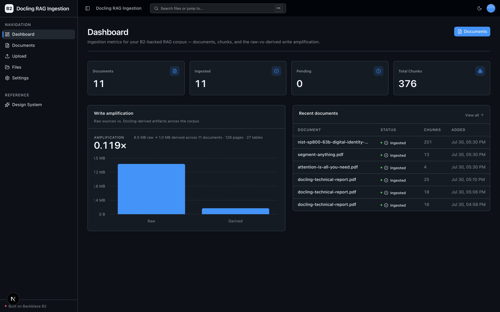
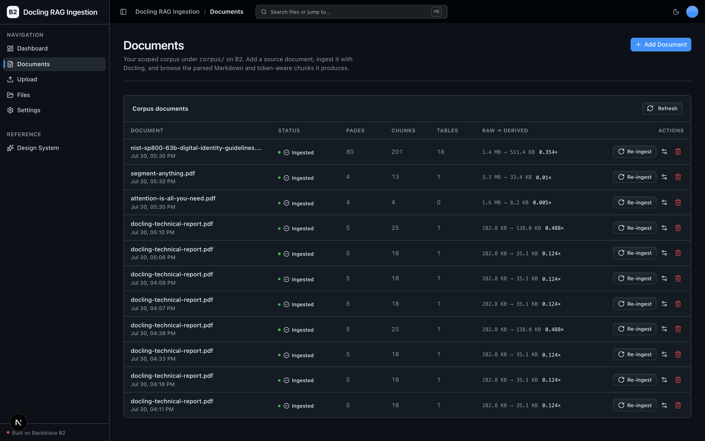
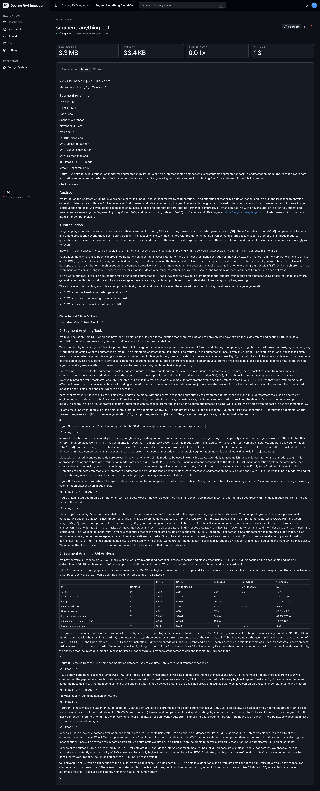
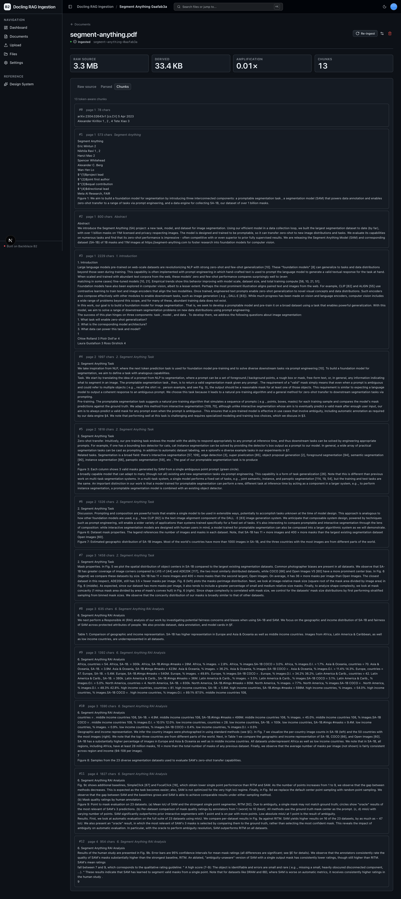

<!-- last_verified: 2026-07-30 -->
# Docling RAG Ingestion

Turn a messy bucket of PDFs into a versioned, RAG-ready corpus — on
**[Backblaze B2](https://www.backblaze.com/cloud-storage?utm_source=github&utm_medium=referral&utm_campaign=ai_artifacts&utm_content=b2ai-docling-rag-ingestion)**.
Drop a raw document (PDF / DOCX / PPTX / HTML) onto B2; [Docling](https://github.com/docling-project/docling)
reads it back, extracts structure (headings, reading order, **tables**), and
produces clean Markdown plus token-aware, metadata-rich chunks. The Markdown and
chunk JSONL land **back on B2, side-by-side with the raw source under a matching
key** — a dual-layer corpus you can point any embedding or vector store at.

B2 is both **source and sink** for the whole pipeline, accessed only through the
S3-compatible API with a custom user agent and the standard `B2_*` env vars. It
runs on local open-source models — **no second API key, B2 credentials only.**

**The headline B2 story is write amplification:** every raw document fans out
into parsed + chunk artifacts, and the app surfaces the raw-vs-derived byte ratio
per document and across the corpus.

**What you get out of the box:**
- Document ingestion with Docling — raw → clean Markdown + token-aware chunks, written back to B2
- A dual-layer, versioned corpus (`source` + `parsed` + `chunks` + `manifest`) under one key per document
- A scoped Corpus library (`/documents`) plus the full-bucket File Explorer (`/files`) and Upload demo
- Write-amplification insight front-and-center on the dashboard
- FastAPI backend with strict layered architecture, structural tests, and a checked OpenAPI contract
- Agent-optimized docs — your AI coding agent can read the repo and start contributing immediately

Audience: developers and data engineers building RAG systems who want a
reproducible, object-storage-native ingestion pattern.

## What it looks like

**Dashboard** — ingestion metrics (documents, ingested, pending, total chunks), a raw-vs-derived write-amplification chart, and the most recent documents in the corpus.



**Documents** — the scoped corpus library over the `corpus/` prefix, listing each document's pages, chunks, tables, and raw → derived amplification.



**Document detail** — the parsed Markdown for an ingested document, with Docling-extracted tables painting inline next to the per-document write-amplification stats.



**Chunks** — the token-aware chunk browser, where each chunk is tagged with its source page, character count, and section heading.



## Agent-First Architecture

This repo is optimized for coding agents. The structure follows the principle
that **repository knowledge is the system of record** — everything an agent needs
to reason about the codebase is versioned, co-located, and discoverable.

**[AGENTS.md](AGENTS.md) is the single source of truth for all coding agents.**
Agent-specific files (CLAUDE.md, GEMINI.md, Copilot instructions) are thin
pointers back to AGENTS.md.

**Architecture is enforced mechanically, not by convention.** Layering rules,
import boundaries, file-size limits, and SDK containment are verified by
structural tests and lints that run on every change.

```
AGENTS.md              Single source of truth — layout, invariants, commands, conventions
ARCHITECTURE.md        System layout, layering rules, data flows, corpus/ key layout
docs/
  features/            Feature docs (document-ingestion, corpus-library, dashboard, …)
  app-workflows.md     User journeys
  dev-workflows.md     Engineering workflows and testing
  SECURITY.md          Security principles
  RELIABILITY.md       Reliability expectations
  exec-plans/          Execution plans and tech debt tracker
```

## How ingestion works

```
corpus/<doc-id>/source.<ext>     raw upload (immutable)
corpus/<doc-id>/parsed.md        Docling Markdown export
corpus/<doc-id>/chunks.jsonl     one JSON chunk record per line
corpus/<doc-id>/manifest.json    status + config + result counts (source of truth)
```

1. **Add a document** — the raw source is written to B2 and a `manifest.json`
   is created with `status: pending`.
2. **Ingest** — the API reads the raw bytes back from B2, runs Docling's
   `DocumentConverter` + `HybridChunker`, and writes `parsed.md` +
   `chunks.jsonl` next to the source, then flips the manifest to `ingested`.
3. **Browse** — the detail view shows the raw preview, the rendered Markdown
   (tables paint), a chunk browser, and the write-amplification ratio.

### First-run model download

The first real ingest downloads Docling's layout/table models (~500 MB–1 GB)
plus a small chunker tokenizer; subsequent runs use the cache. Ingestion runs on
device and **auto-detects the accelerator (CUDA → Apple MPS → CPU), defaulting to
CPU** — no GPU is required. There is **no external API key** and no per-token cost;
you pay only for B2 storage and egress.

## Quick Start

You need: Node.js >= 20, pnpm >= 9, Python >= 3.11, and a free **[Backblaze B2 account](https://www.backblaze.com/sign-up/ai-cloud-storage?utm_source=github&utm_medium=referral&utm_campaign=ai_artifacts&utm_content=b2ai-docling-rag-ingestion)**.

### Supported local environments

Local scripts are supported on macOS, Linux, and WSL2. Native Windows is not
supported yet because the dev scripts use POSIX shell syntax and
`services/api/.venv/bin/*` paths; use WSL2 on Windows.

### Setup

**1. Run setup**

```bash
pnpm run setup
```

This copies `.env.example` to `.env` only when `.env` does not already exist,
installs workspace dependencies from `pnpm-lock.yaml`, creates
`services/api/.venv` if missing, and installs the API's committed Python 3.11
resolution from `services/api/requirements.lock`. It is safe to rerun and never
overwrites an existing `.env`.

> Use the `pnpm run` form: `setup` (like `doctor`) is a built-in pnpm command
> before pnpm 11, so bare `pnpm setup` would run pnpm's own command instead of
> this script.

**2. Add your B2 credentials**

Open `.env` and head to the [Backblaze B2 dashboard](https://secure.backblaze.com/b2_buckets.htm?utm_source=github&utm_medium=referral&utm_campaign=ai_artifacts&utm_content=b2ai-docling-rag-ingestion):

| `.env` key | Where it comes from |
|---|---|
| `B2_APPLICATION_KEY_ID` | Application key **keyID** (Read & Write) |
| `B2_APPLICATION_KEY` | Application key **applicationKey** *(shown once)* |
| `B2_BUCKET_NAME` | Your bucket's unique name |
| `B2_REGION` | Bucket region, e.g. `us-west-004` (the S3 endpoint is derived from it) |
| `B2_PUBLIC_URL_BASE` | *Optional* — public base URL for a public bucket; leave empty for private |

The S3-compatible endpoint is derived as `https://s3.<B2_REGION>.backblazeb2.com`,
so there is no separate endpoint variable to keep in sync.

> Want a walkthrough? See the docs for [creating a bucket](https://www.backblaze.com/docs/cloud-storage-create-and-manage-buckets?utm_source=github&utm_medium=referral&utm_campaign=ai_artifacts&utm_content=b2ai-docling-rag-ingestion) and [creating app keys](https://www.backblaze.com/docs/cloud-storage-create-and-manage-app-keys?utm_source=github&utm_medium=referral&utm_campaign=ai_artifacts&utm_content=b2ai-docling-rag-ingestion).

**3. Run it**

```bash
pnpm dev
```

Frontend at `localhost:3000`, API at `localhost:8000`. Open **Documents**, add a
PDF, click **Ingest**, and watch it fan out into Markdown + chunks on B2.
Interactive API docs are at `localhost:8000/docs`.

`pnpm dev` runs the preflight check first — it catches common setup gotchas
(wrong Node/Python version, missing venv, missing or placeholder `.env`, ports
already taken). Run it standalone any time with `pnpm run doctor`.

## Core Features

- [Document Ingestion](docs/features/document-ingestion.md) — Docling parse + chunk, written back to B2
- [Corpus Library](docs/features/corpus-library.md) — the scoped `/documents` view over `corpus/`
- [Dashboard](docs/features/dashboard.md) — ingestion metrics + write amplification
- [File Upload](docs/features/file-upload.md) — drag-and-drop raw upload demo
- [File Browser](docs/features/file-browser.md) — full-bucket list, preview, download, delete
- [Metadata Extraction](docs/features/metadata-extraction.md) — image dimensions, EXIF, PDF info, checksums
- [Design System](docs/design-system.md) — tokens, primitives, loader, error/empty states. Live at `/design`.
- Centralized data layer — every fetch goes through TanStack Query hooks; no bare `useEffect + fetch`
- Checked API contract — `docs/api/openapi.json` plus `pnpm contract:check` catch FastAPI/client route drift
- Structural tests — layering rules, import boundaries, SDK containment, file-size limits
- `/health` (B2 connectivity) and `/metrics` (Prometheus) endpoints

## Tech Stack

- TypeScript, Next.js 16, React 19, Tailwind v4, shadcn/ui, Recharts, react-markdown + remark-gfm
- TanStack Query — caching, dedup, retry, stale-while-revalidate for every fetch
- Python 3.11+, FastAPI, boto3, Pydantic v2, **Docling + transformers** (on-device parse + chunk)
- Backblaze B2 (S3-compatible object storage) — source and sink
- pnpm workspaces (monorepo)

## Commands

| Command | What it does |
|---------|-------------|
| `pnpm run setup` | Idempotently copy `.env.example` to `.env` only if missing, install workspace dependencies, create the backend venv, and install the locked API dependencies |
| `pnpm run doctor` | Preflight environment check (also runs automatically before `pnpm dev`) |
| `pnpm dev` | Start frontend + backend |
| `pnpm dev:web` | Frontend only |
| `pnpm dev:api` | Backend only |
| `pnpm contract:export` | Export deterministic FastAPI OpenAPI JSON to `docs/api/openapi.json` |
| `pnpm contract:check` | Verify the checked-in OpenAPI artifact and frontend API client route registry |
| `pnpm check:agent-docs` | Validate agent shims, command docs, CI claims, and `.env` ignore coverage |
| `pnpm verify` | Credential-free canonical non-live pre-PR suite — runs `check:agent-docs`, `verify:api`, then `verify:web` |
| `pnpm verify:api` | Backend half: API lint, API tests, structure tests |
| `pnpm verify:web` | Frontend half: web lint, web unit tests, web typecheck + build |
| `pnpm verify:full` | `pnpm run doctor`, then `pnpm verify`, then Playwright E2E; requires populated `.env`, local server/browser permission, port 3000 free, and Chromium installed |
| `pnpm build` | Build frontend |
| `pnpm lint` | Lint frontend |
| `pnpm lint:api` | Lint backend (ruff) |
| `pnpm test:web` | Run frontend unit tests (vitest) |
| `pnpm test:api` | Run backend tests |
| `pnpm check:structure` | Verify layering rules |
| `pnpm test:e2e` | Playwright E2E smoke tests |

Run `pnpm run setup` once before local development, and rerun it after pulling
dependency changes. If you add a Node dependency yourself, run `pnpm install` to
refresh `pnpm-lock.yaml`; for an API dependency, follow the reviewed refresh
workflow in [docs/dev-workflows.md](docs/dev-workflows.md#python-dependency-updates).
Run `pnpm verify` before opening a PR; it needs `services/api/.venv` from setup.
Run `pnpm verify:full` when you can start the local app stack and browser tests.

`pnpm verify` needs neither B2 credentials nor a browser, and it does **not**
install or import the Docling/torch stack — Docling imports are lazy and the
ingestion service is tested with the engine stubbed, so the suite stays fast.
The real parse runs when you `pnpm dev` and ingest a document.

## Documentation Map

| Doc | Purpose |
|-----|---------|
| [AGENTS.md](AGENTS.md) | Agent table of contents — start here |
| [ARCHITECTURE.md](ARCHITECTURE.md) | System layout, layering, data flows, corpus/ key layout |
| [docs/features/](docs/features/) | Feature docs (ingestion, corpus library, dashboard, upload, browser, metadata) |
| [docs/app-workflows.md](docs/app-workflows.md) | User journeys |
| [docs/dev-workflows.md](docs/dev-workflows.md) | Engineering workflows and testing |
| [docs/SECURITY.md](docs/SECURITY.md) | Security principles |
| [docs/RELIABILITY.md](docs/RELIABILITY.md) | Reliability expectations |
| [docs/exec-plans/](docs/exec-plans/) | Execution plans and tech debt tracker |

## License

MIT License - see [LICENSE](LICENSE) for details.

## Claude Agent B2 Skill

Manage Backblaze B2 from your terminal using natural language (list/search, audits, stale or large file detection, security checks, safe cleanup).

Repo: [https://github.com/backblaze-b2-samples/claude-skill-b2-cloud-storage](https://github.com/backblaze-b2-samples/claude-skill-b2-cloud-storage)
